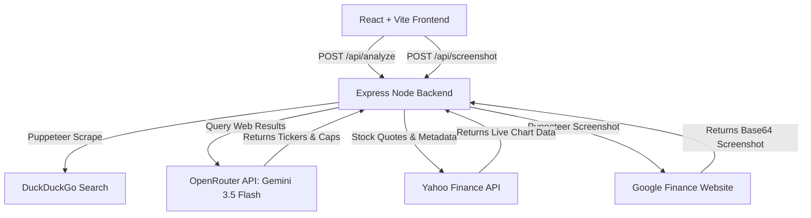

# SectorTrend: Market Trend Intelligence & Sector Analyzer

SectorTrend is a modern web application that analyzes market capitalisation trends for publicly traded companies within any arbitrary industry sector and region. By combining search scraping, generative AI classification, live financial quote retrieval, and headless screenshot rendering, SectorTrend offers a real-time dashboard of sector leaders and their historical trajectories.

---

## 🌟 Key Features

1. **Intelligent Sector Discovery & Ticker Resolution**
   - Resolves the top 10 largest publicly traded companies for any query (e.g. *"Cybersecurity, US"*, *"Automotive, Germany"*, *"Steel, India"*).
   - Standardizes official sector naming conventions (e.g. maps "IT" to "Information Technology Services").
   - Automatically determines correct Yahoo Finance exchange suffixes (`.NS`/`.BO` for India, `.DE` for Germany, `.L` for UK, `.AX` for Australia, etc.).

2. **Multi-Source Financial Aggregation**
   - Retrieves live pricing, daily percentage change, trading exchanges, and currency values.
   - Fetches historical daily closing chart data (configurable across 1 month, 3 months, 6 months, and 1 year).
   - Implements a resilient dual-endpoint fallback (combining Quote and Chart metadata endpoints) to bypass Yahoo Finance cookie/crumb restrictions and 401 Unauthorized limits.

3. **Live Screenshot Proof via Headless Browser**
   - Spawns a headless Chromium instance (`puppeteer`) on the backend to load Google Finance charts live for validation.
   - Captures and streams Base64 stock chart screenshot crops directly into the frontend.

4. **Rich Interactive UI & Dashboards**
   - Curated HSL-tailored dark/glassmorphic design system.
   - Real-time loading progress logging (visualizing each step of the scraping and analysis workflow).
   - SVG Sparklines inside stock grid cards.
   - Interactive, custom-built modal charts featuring Y-gridlines, axis labels, cursor crosshairs, and date-price tooltips.
   - Bring Your Own Key (BYOK) drawer settings to supply custom OpenRouter keys stored locally in `localStorage`.

5. **Built-in Fallbacks**
   - When no OpenRouter API key is provided, the system supports fully offline/preloaded catalog demonstrations for *"Cybersecurity, US"* and *"Steel, India"*.

---

## 🏗️ Architecture & Technology Stack



### Frontend
- **Framework**: React (Vite-based)
- **Styling**: Vanilla CSS with HSL variables (Glassmorphism, CSS grid, custom animations).
- **Icons & Visuals**: Inline SVG graphics and dynamically constructed SVG trend paths.

### Backend
- **Framework**: Express (Node.js)
- **Scraping & Automation**: `puppeteer` for scraping search results and capturing stock proof screenshots.
- **AI Engine**: Gemini 3.5 Flash via OpenRouter.
- **HTTP Client**: `axios` with global server caching (30-minute TTL) for Yahoo Finance API calls.

---

## ⚙️ Setup & Installation

### Prerequisites
- Node.js (v18 or higher recommended)
- Google Chrome or Chromium (Puppeteer will automatically download a compatible local browser binary during installation).

### 1. Clone & Install Dependencies
```bash
npm install
```

### 2. Configure Environment Variables
Create a `.env` file in the root directory (based on the placeholder `.env` provided):
```env
# OpenRouter API Key for Gemini 3.5 Flash stock ticker resolution
OPENROUTER_API_KEY=your_openrouter_api_key_here
PORT=5001
```

*Note: If `OPENROUTER_API_KEY` is omitted, the app runs in fallback mode and only resolves queries for "Cybersecurity, US" and "Steel, India".*

### 3. Run the Development Server

Start both the React dev server (port 3000) and the backend Express proxy (port 5001) in separate terminals:

**Start Backend (Port 5001)**:
```bash
node server.js
```

**Start Frontend (Port 3000)**:
```bash
npm run dev
```

---

## 🔒 Security Practices

- **Zero Hardcoded Secrets**: All backend API keys are read strictly from process environment variables (`process.env`).
- **Client Key Encryption / Local Isolation**: If a user supplies their own API key via the settings drawer, it is saved in browser-local cache (`localStorage`) and only sent over transit in API requests, never stored persistently on the backend disk.
- **Ignored Environment Files**: `.env` and `.env.local` configurations are listed in `.gitignore` to prevent accidental credential exposures in repository commits.
